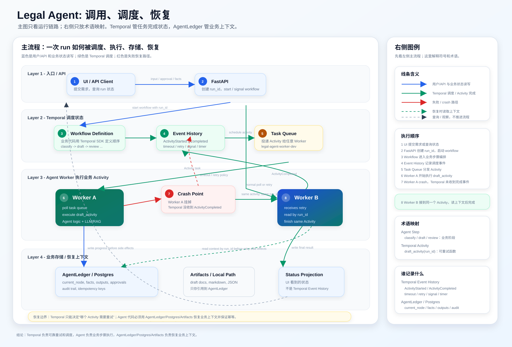
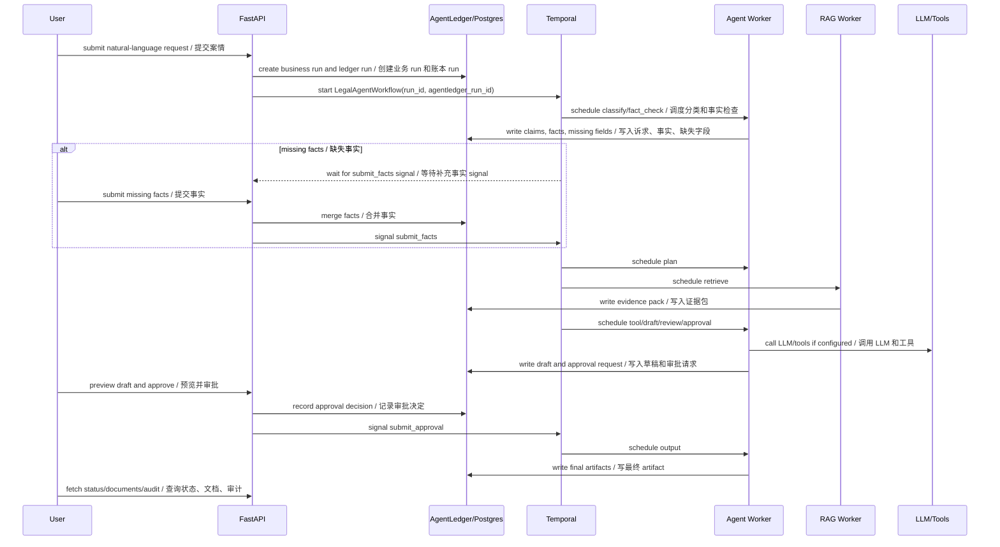

# Architecture / 架构原理

Legal Agent is a workflow-backed legal document agent. The main goal is to make each agent run durable, inspectable, and recoverable instead of treating it as a single LLM call.

Legal Agent 是一个由 Workflow 驱动的法律文书 Agent。核心目标不是“一次 prompt 生成文书”，而是让每次 Agent Run 都具备持久化调度、可观测、可审计、可恢复能力。



## Mental Model / 核心心智模型

There are three layers:

系统可以按三层理解：

1. Product/API layer: accepts user input, exposes UI/API, reads business status.  
   产品/API 层：接收用户输入，提供 UI/API，读取业务状态。
2. Orchestration layer: Temporal stores workflow event history and schedules activities.  
   调度层：Temporal 保存 workflow event history，并调度 Activity。
3. Business runtime layer: Agent code and AgentLedger store legal facts, tools, artifacts, and approvals.  
   业务运行层：Agent 代码和 AgentLedger 保存法律事实、工具调用、artifact、审批等业务上下文。

Temporal answers: "which workflow step should run or retry next?"  
Temporal 回答：“下一步应该执行或重试哪个 workflow step？”

AgentLedger answers: "what business context does this agent run already have?"  
AgentLedger 回答：“这次 agent run 已经积累了哪些业务上下文？”

The agent activity code connects both sides by reading identifiers such as `run_id` and `agentledger_run_id`.

Agent 的 Activity 代码通过 `run_id`、`agentledger_run_id` 把两者连接起来。

## Component Model / 组件模型

| Component / 组件 | Responsibility / 职责 |
| --- | --- |
| Web UI | Starts runs, collects missing facts, previews drafts, submits approvals, downloads documents. / 创建 run、补充事实、预览草稿、提交审批、下载文档。 |
| FastAPI | Product API, idempotency, file upload, status projection, document/audit/replay endpoints. / 产品 API、幂等、上传文件、状态投影、文档/审计/回放接口。 |
| Temporal | Durable workflow engine: event history, activity scheduling, timers, signals, retries. / 持久化工作流引擎：event history、Activity 调度、timer、signal、重试。 |
| `legal-agent-worker` | Main agent activities: classify, fact check, plan, tool, draft, review, approval, output. / 主 Agent Activity 执行池。 |
| `rag-worker` | Retrieval activities against legal/user material. / 法规、案例、模板、用户材料检索。 |
| `embedding-worker` | Embedding backfill workflows. / 向量补齐和后台 embedding 任务。 |
| PostgreSQL/pgvector | Business runs, facts, RAG chunks, idempotency records, AgentLedger tables. / 业务 run、事实、RAG chunk、幂等记录、AgentLedger 表。 |
| AgentLedger | Runtime ledger for state, tool ledger, artifacts, approvals, events, replay data. / 业务运行账本：状态、工具账本、artifact、审批、事件、回放数据。 |
| Shared data volume | Larger blob artifacts such as Markdown, DOCX, JSON snapshots, uploaded material. / 大文件 artifact，例如 Markdown、DOCX、JSON 快照、上传材料。 |
| Langfuse | Optional self-hosted tracing for LLM calls and activity spans. / 可选自托管 LLM tracing 和 activity span。 |

AgentLedger upstream for this project:

AgentLedger 项目地址：

<https://github.com/yaogdu/AgentLedger>

In local Compose, this repository expects a sibling checkout mounted as `../agent-runtime:/opt/agent-runtime:ro`, with `AGENTLEDGER_SRC=/opt/agent-runtime/src`.

本地 Compose 期望同级目录存在 AgentLedger 源码，并挂载为 `../agent-runtime:/opt/agent-runtime:ro`，容器内通过 `AGENTLEDGER_SRC=/opt/agent-runtime/src` 加载。

## Workflow Ownership / Workflow 是谁定义的

The workflow is defined by this business application, not by Temporal configuration.

Workflow 是这个业务应用定义的，不是 Temporal 配置里自动生成的。

Relevant files:

相关文件：

- `src/legal_agent/workflows/legal_agent.py`: Temporal workflow definitions / Temporal Workflow 定义；
- `src/legal_agent/workflows/activities.py`: Activity implementations / Activity 实现；
- `src/legal_agent/workflows/worker.py`: Worker registration and task queues / Worker 注册和 task queue；
- `src/legal_agent/workflows/client.py`: API-side workflow start/signal/cancel client / API 侧启动、signal、取消 workflow 的 client；
- `src/legal_agent/api/app.py`: product API that creates runs and sends signals / 创建 run 并发送 signal 的产品 API。

Temporal knows the workflow shape because workers register workflow and activity definitions through the Temporal Python SDK. The Temporal server persists event history and dispatches tasks, but the business step list comes from application code.

Temporal 之所以知道 workflow 长什么样，是因为 Worker 通过 Temporal Python SDK 注册了 Workflow 和 Activity 定义。Temporal Server 负责保存 event history 和分发任务，但业务步骤列表来自应用代码。

## Activity to Agent Step Mapping / Activity 和 Agent 步骤的关系

The following names are business activity names, not Temporal built-in states:

下面这些名字是业务 Activity，不是 Temporal 内置状态：

```text
classify
fact_check
plan
retrieve
tool
draft
review
approval
output
```

Mapping:

对应关系：

| Agent step / Agent 步骤 | Temporal activity / Temporal Activity | Business meaning / 业务含义 |
| --- | --- | --- |
| classify | `classify_activity` | Classify task type, domain, risk. / 判断任务类型、领域、风险。 |
| fact_check | `fact_check_activity` | Extract claims and detect missing facts. / 识别诉求并检查缺失事实。 |
| ask_user | Temporal `wait_condition` + `submit_facts` signal | Wait for missing facts. / 等待用户补充事实。 |
| plan | `plan_activity` | Build execution plan. / 生成执行计划。 |
| retrieve | `retrieve_activity` on RAG queue | Retrieve statutes, cases, templates, user material. / 检索法规、案例、模板、用户材料。 |
| tool | `tool_activity` | Run deterministic business tools. / 执行确定性业务工具。 |
| draft | `draft_activity` | Generate draft document. / 生成草稿。 |
| review | `review_activity` | Check citation, format, risk. / 检查引用、格式、风险。 |
| approval | `approval_activity` + `submit_approval` signal | Create and wait for approval. / 创建并等待审批。 |
| output | `output_activity` | Persist final documents. / 落最终文档。 |

Temporal tracks whether each Activity attempt started, completed, failed, timed out, or retried. It does not understand legal semantics such as "year-end bonus evidence is missing". That belongs to the agent code and AgentLedger.

Temporal 记录每个 Activity attempt 是否开始、完成、失败、超时或重试。它不理解“年终奖证据缺失”这种法律业务语义；这些属于 Agent 代码和 AgentLedger。

## Run Lifecycle / Run 生命周期



## Failure and Recovery / 失败与恢复

This is the key production pattern:

这是最关键的生产化模式：

1. Temporal schedules an Activity, for example `draft_activity`.  
   Temporal 调度一个 Activity，例如 `draft_activity`。
2. A worker picks up the task and starts executing.  
   某个 Worker 拉取任务并开始执行。
3. If the worker crashes before Temporal receives `ActivityTaskCompleted`, Temporal's event history still shows that the Activity did not complete.  
   如果 Worker 在 Temporal 收到 `ActivityTaskCompleted` 前挂掉，Temporal 的 event history 里仍然显示该 Activity 未完成。
4. After timeout/failure, Temporal applies the retry policy and schedules another attempt of the same Activity.  
   超时或失败后，Temporal 根据 retry policy 重新调度同一个 Activity。
5. Any healthy worker polling the same task queue can receive the retry.  
   任意健康且监听同一 task queue 的 Worker 都可能收到重试任务。
6. The retried Activity receives the same stable identifiers, such as `run_id` and `agentledger_run_id`.  
   重试 Activity 会拿到同样稳定的标识，例如 `run_id` 和 `agentledger_run_id`。
7. Agent code reloads business context from PostgreSQL/AgentLedger/artifacts.  
   Agent 代码从 PostgreSQL、AgentLedger、artifact 中恢复业务上下文。
8. Agent code uses existing state and idempotency keys to avoid duplicate side effects.  
   Agent 代码根据已有状态和幂等 key 避免重复副作用。
9. When the Activity completes successfully, Temporal appends `ActivityTaskCompleted` and moves to the next step.  
   Activity 成功完成后，Temporal 追加 `ActivityTaskCompleted`，Workflow 才进入下一步。

So the split is:

所以分工是：

- Temporal restores orchestration position.  
  Temporal 恢复“调度位置”：哪个 Activity 没完成，哪个 Activity 应该重试。
- AgentLedger restores business context.  
  AgentLedger 恢复“业务上下文”：事实、证据、工具结果、草稿、审批等。
- Activity code bridges both.  
  Activity 代码负责把二者衔接起来。

## State Fusion / 状态融合

There are three related state layers:

这里有三层相关状态：

| State layer / 状态层 | Owner / 归属 | Purpose / 用途 |
| --- | --- | --- |
| Temporal event history | Temporal | Durable orchestration and replay of workflow progress. / 持久化调度、workflow replay、Activity 完成/失败/重试记录。 |
| Business projection | Application database / 应用数据库 | Fast status reads for API/UI: `RUNNING`, `WAITING_USER_INPUT`, current node, progress. / API/UI 快速读取业务状态。 |
| AgentLedger runtime state | AgentLedger | Auditable business context: facts, tools, artifacts, approvals, replay. / 可审计业务上下文。 |

The API mostly reads business projection and AgentLedger records because those are user-facing and domain-aware. Temporal UI is operational: scheduling, retries, signals, timers, and worker health.

API 主要读业务投影和 AgentLedger，因为它们面向用户并且有业务语义。Temporal UI 主要用于运维：调度、重试、signal、timer、worker 健康状态。

## Claim-Driven Intake / 诉求驱动的事实收集

The user does not need to fit a fixed form at the beginning. The agent first extracts claims from text.

用户一开始不需要适配固定表单。Agent 会先从文本中识别诉求。

Known claim types include:

已内置的诉求类型包括：

- illegal termination damages / 违法解除赔偿金；
- economic compensation / 经济补偿金；
- unpaid salary / 拖欠工资；
- double salary for no written contract / 未签书面劳动合同二倍工资差额；
- year-end bonus / 年终奖；
- overtime pay / 加班费；
- unused annual leave pay / 未休年休假工资报酬；
- social insurance related claims / 社保相关请求。

Unknown claims are normalized as custom claims:

未知诉求会被归一化为自定义诉求：

```json
{
  "type": "custom",
  "key": "stock_option_compensation",
  "label": "期权补偿",
  "requested": "期权兑现损失",
  "custom": true
}
```

For custom claims, the system asks for basis, amount/calculation, and evidence fields. This keeps the intake open-ended while still producing structured facts for tools and document templates.

对于自定义诉求，系统会追问依据、金额/计算方式、证据字段。这样既能保持诉求开放，又能给工具和文书模板提供结构化事实。

## Scaling and HA / 扩容与高可用

The local scripts scale workers horizontally by default:

本地脚本默认横向扩展 Worker：

```bash
LEGAL_AGENT_WORKERS=3 LEGAL_AGENT_RAG_WORKERS=2 LEGAL_AGENT_EMBEDDING_WORKERS=2 bash scripts/start.sh full
```

Worker replicas are stateless compute processes. They can be restarted or scaled independently because Temporal owns task dispatch and AgentLedger/PostgreSQL own durable business data.

Worker 副本是无状态计算进程。它们可以独立重启和扩容，因为任务调度由 Temporal 管，持久化业务数据由 AgentLedger/PostgreSQL 管。

The current `temporalio/auto-setup` container is for local/demo use. Production HA should replace it with a real Temporal deployment:

当前 `temporalio/auto-setup` 适合本地/Demo。生产高可用应该替换为正式 Temporal 部署：

- multiple Temporal frontend/history/matching/worker services;  
  多个 Temporal frontend/history/matching/worker 服务；
- external production database;  
  外部生产数据库；
- controlled namespace and search-attribute setup;  
  受控 namespace 和 search attribute 初始化；
- backup and retention policies;  
  备份和保留策略；
- production-grade metrics and alerting.  
  生产级指标和告警。

PostgreSQL, ClickHouse, Redis, and object storage also need their own HA and backup strategy in production.

生产环境下 PostgreSQL、ClickHouse、Redis、对象存储也需要各自的高可用和备份策略。

## Related Diagrams / 相关图

- [Execution flow / 执行流](diagrams/legal_agent_execution_flow.svg)
- [Labor arbitration case flow / 劳动仲裁案例流程](diagrams/legal_labor_arbitration_case_flow.svg)
- [RAG architecture / RAG 架构](diagrams/legal_rag_architecture.svg)
- [Runtime governance / 运行治理](diagrams/legal_runtime_governance.svg)
